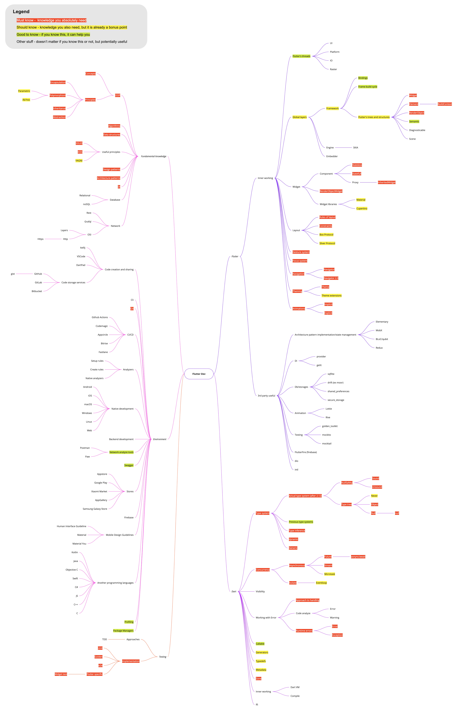

# Flutter Developer Knowledge Map

This map contains my own view of the knowledge and skills, which Flutter developer need.
I'm standing on my own work experience in creation and supporting this map.
You can use it like a roadmap for learning and improve you skill level in Flutter.
But please, keep in mind, that all cases are different and pay attention to your own
circumstances when going to choose something to learn.

## Maintainer

[Mikhail Zotyev](https://github.com/MbIXjkee)